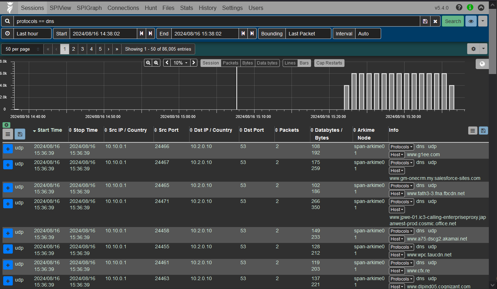
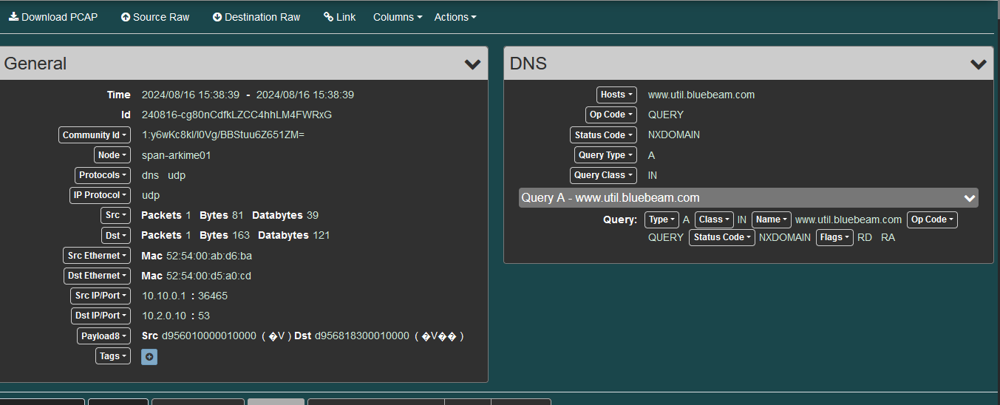
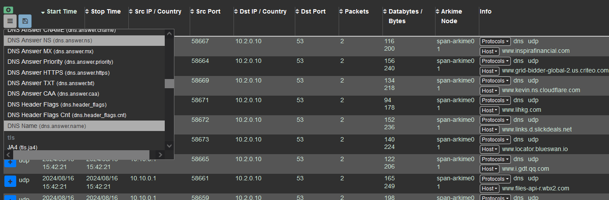

# Network Analysis & Packet Capture with Arkime

- [Network Analysis \& Packet Capture with Arkime](#network-analysis--packet-capture-with-arkime)
  - [Description](#description)
  - [Network Topology](#network-topology)
  - [Install Arkime](#install-arkime)
    - [Install OpenSearch](#install-opensearch)
    - [Installing Arkime Sensors](#installing-arkime-sensors)
  - [Accessing the Arkime UI](#accessing-the-arkime-ui)
  - [Sample Usage of Arkime API](#sample-usage-of-arkime-api)

## Description

Here is how to install/use Arkime.

## Network Topology


```
Client
 |
 | | ^
 | v |
 |       ---> (span. both directions)
FDio vpp ---------------- Arkime node
 |
 | | ^
 | v |
 |
DNS Servers
```

## Install Arkime

Reference
- [Installation Guide for Arkime](https://arkime.com/install)
- [How to Install Arkime with Elasticsearch 8 on Ubuntu 24.04](https://kifarunix.com/how-to-install-arkime-with-elasticsearch-8-on-ubuntu-24-04/)

Here is the spec on which I installed Arkime.
```
# lsb_release -a
No LSB modules are available.
Distributor ID: Ubuntu
Description:    Ubuntu 24.04 LTS
Release:        24.04
Codename:       noble
```

```
# free -mh
               total        used        free      shared  buff/cache   available
Mem:            11Gi       3.0Gi       5.2Gi       1.3Mi       3.9Gi       8.6Gi
Swap:             0B          0B          0B
```

```
# grep -c 'model name' /proc/cpuinfo 
4
```

### Install OpenSearch

I installed OpenSearch and OpenSearch Dashboard with docker-compose.<br>
See [Try OpenSearch with Docker Compose](https://opensearch.org/downloads.html)

```
# docker compose ps
NAME                    IMAGE                                            COMMAND                  SERVICE                 CREATED        STATUS         PORTS
opensearch-dashboards   opensearchproject/opensearch-dashboards:latest   "./opensearch-dashbo…"   opensearch-dashboards   15 hours ago   Up 2 minutes   0.0.0.0:5601->5601/tcp, :::5601->5601/tcp
opensearch-node1        opensearchproject/opensearch:latest              "./opensearch-docker…"   opensearch-node1        15 hours ago   Up 2 minutes   0.0.0.0:9200->9200/tcp, :::9200->9200/tcp, 9300/tcp, 0.0.0.0:9600->9600/tcp, :::9600->9600/tcp, 9650/tcp
opensearch-node2        opensearchproject/opensearch:latest              "./opensearch-docker…"   opensearch-node2        15 hours ago   Up 2 minutes   9200/tcp, 9300/tcp, 9600/tcp, 9650/tcp
```

### Installing Arkime Sensors

```
# dpkg -l|grep arkime
ii  arkime                          5.4.0-1                                 amd64        Arkime Full Packet System
```

[Initialize the OpenSearch/Elasticsearch database](https://arkime.com/install#initialize-the-opensearchelasticsearch-database)
```
# /opt/arkime/db/db.pl --esuser admin:${password} https://localhost:9200 init
It is STRONGLY recommended that you stop ALL Arkime captures and viewers before proceeding.  Use 'db.pl https://localhost:9200 backup' to backup db first.

There are 2 OpenSearch/Elasticsearch data nodes, if you expect more please fix first before proceeding.

This is a fresh Arkime install
Erasing
Creating
Finished
```

[Configure Arkime](https://arkime.com/install#configure-arkime)
```
# /opt/arkime/bin/Configure
Found interfaces: lo;enp1s0;enp7s0;docker0;br-7bfcb8050001;vethc0637bf@if6;vethef28d9a@if8;vethfa5dfb0@if10
Semicolon ';' seperated list of interfaces to monitor [eth1] enp7s0
Install Elasticsearch server locally for demo, must have at least 3G of memory, NOT recommended for production use (yes or no) [no] no
OpenSearch/Elasticsearch server URL [https://localhost:9200]
OpenSearch/Elasticsearch user [empty is no user] admin
OpenSearch/Elasticsearch password [empty is no password] ${password}
Password to encrypt S2S and other things, don't use spaces [must create one] ${password}
Arkime - Creating configuration files
Installing sample /opt/arkime/etc/config.ini
sed: can't read : No such file or directory
Arkime - Installing /etc/security/limits.d/99-arkime.conf to make core and memlock unlimited
Download GEO files? You'll need a MaxMind account https://arkime.com/faq#maxmind (yes or no) [yes] yes
Arkime - Downloading GEO files
2024-08-16 05:54:18 URL:https://www.iana.org/assignments/ipv4-address-space/ipv4-address-space.csv [23323/23323] -> "/tmp/tmp.mPPQSQ2c5J" [1]
2024-08-16 05:54:19 URL:https://www.wireshark.org/download/automated/data/manuf [2806844/2806844] -> "/tmp/tmp.Q3aPMk3k6J" [1]

Arkime - Configured - Now continue with step 4 in /opt/arkime/README.txt

 4) The Configure script can install OpenSearch/Elasticsearch for you or you can install yourself
 5) Initialize/Upgrade OpenSearch/Elasticsearch Arkime configuration
  a) If this is the first install, or want to delete all data
      /opt/arkime/db/db.pl http://ESHOST:9200 init
  b) If this is an update to an Arkime package
      /opt/arkime/db/db.pl http://ESHOST:9200 upgrade
 6) Add an admin user if a new install or after an init
      /opt/arkime/bin/arkime_add_user.sh admin "Admin User" THEPASSWORD --admin
 7) Start everything
      systemctl start arkimecapture.service
      systemctl start arkimeviewer.service
 8) Look at log files for errors
      /opt/arkime/logs/viewer.log
      /opt/arkime/logs/capture.log
 9) Visit http://arkimeHOST:8005 with your favorite browser.
      user: admin
      password: THEPASSWORD from step #6

If you want IP -> Geo/ASN to work, you need to setup a maxmind account and the geoipupdate program.
See https://arkime.com/faq#maxmind

Any configuration changes can be made to /opt/arkime/etc/config.ini
See https://arkime.com/faq#arkime-is-not-working for issues

Additional information can be found at:
  * https://arkime.com/install
  * https://arkime.com/faq
  * https://arkime.com/settings
```

Here is the capture interface.
```
# grep ^interface /opt/arkime/etc/config.ini
interface=enp7s0
```

[Adding admin user](https://arkime.com/install#adding-admin-user)
```
# /opt/arkime/bin/arkime_add_user.sh admin "Admin User" ${password} --admin
WARNING - Using authMode=digest since not set, add to config file to silence this warning.
Added
```

[Start the Arkime Sensor](https://arkime.com/install#start-the-arkime-sensor)
```
# systemctl enable --now arkimecapture.service arkimeviewer.service
```

```
# systemctl is-active arkimecapture.service arkimeviewer.service
active
active

# ps aux |grep arkime|grep -v grep
root        3926  0.0  0.0   2800  1664 ?        Ss   06:07   0:00 /bin/sh -c /opt/arkime/bin/node viewer.js -c /opt/arkime/etc/config.ini  >> /opt/arkime/logs/viewer.log 2>&1
nobody      3932  0.7  0.7 1318540 89864 ?       Sl   06:07   0:00 /opt/arkime/bin/node viewer.js -c /opt/arkime/etc/config.ini
root        3953  0.0  0.0   2800  1664 ?        Ss   06:07   0:00 /bin/sh -c /opt/arkime/bin/capture -c /opt/arkime/etc/config.ini  >> /opt/arkime/logs/capture.log 2>&1
nobody      3954  0.2  5.1 953744 626324 ?       SLl  06:07   0:00 /opt/arkime/bin/capture -c /opt/arkime/etc/config.ini
```

Accessing the Arkime UI<br>
Go to `http:// Arkime IP:8005`
```
# ss -tanp src :8005
State                Recv-Q               Send-Q                             Local Address:Port                             Peer Address:Port               Process
LISTEN               0                    511                                            *:8005                                        *:*                   users:(("node",pid=3932,fd=29))
```

[Configuring Cont3xt](https://arkime.com/install#configuring-cont3xt)
```
# /opt/arkime/bin/Configure --cont3xt
OpenSearch/Elasticsearch server URL [https://localhost:9200]
OpenSearch/Elasticsearch user [empty is no user] admin
OpenSearch/Elasticsearch password [empty is no password] ${password}
Password to encrypt users, keys, etc. Should be the same across tools [must create one] ${password}
Installing sample /opt/arkime/etc/cont3xt.ini
sed: can't read : No such file or directory
Enabling & Starting cont3xt systemd files
Created symlink /etc/systemd/system/multi-user.target.wants/arkimecont3xt.service → /etc/systemd/system/arkimecont3xt.service.
```

```
systemctl enable --now arkimecont3xt
```

```
# systemctl is-active arkimecont3xt.service
active
```

You can find config files at:
```
# ls /opt/arkime/etc/
arkimecapture.systemd.service     arkimeviewer.systemd.service  config.ini.sample   env.example             parliament.env.example
arkimecont3xt.systemd.service     arkimewise.systemd.service    cont3xt.ini         ipv4-address-space.csv  parliament.ini.sample
arkimeparliament.systemd.service  config.ini                    cont3xt.ini.sample  oui.txt                 wise.ini.sample
```

## Accessing the Arkime UI

Generate traffic so that Arkime can collect wire data.





## Sample Usage of Arkime API

[Viewer v3.x - v5.x API](https://arkime.com/apiv3#viewer-v3x---v5x-api)

This sample script displays 10 FQDNs and dowloads a pcapng file.
```
$ ./arkime_api_sample.py -u admin -p ${PASSWORD} -i 192.168.100.186
['www.microsoft.com']
['www.windowsupdate.com']
['www.google.com']
['www.microsoftonline.com']
['www.data.microsoft.com']
['www.events.data.microsoft.com']
['www.ctldl.windowsupdate.com']
['www.live.com']
['www.www.google.com']
['www.office.com']
```

Save a pcap file as dns.pcap
```
$ tshark -nn -r dns.pcap
    1   0.000000    10.10.0.0 → 10.2.0.10    DNS 83 Standard query 0xd956 A www.microsoftonline.com
    2  -0.000012    10.10.0.0 → 10.2.0.10    DNS 87 Standard query 0xd956 A www.ctldl.windowsupdate.com
    3  -0.000012    10.10.0.0 → 10.2.0.10    DNS 89 Standard query 0xd956 A www.events.data.microsoft.com
    4  -0.000012    10.10.0.0 → 10.2.0.10    DNS 81 Standard query 0xd956 A www.windowsupdate.com
    5   0.000000    10.10.0.0 → 10.2.0.10    DNS 72 Standard query 0xd956 A www.live.com
    6  -0.000012    10.10.0.0 → 10.2.0.10    DNS 74 Standard query 0xd956 A www.google.com
    7  -0.000012    10.10.0.0 → 10.2.0.10    DNS 77 Standard query 0xd956 A www.microsoft.com
    8  -0.000012    10.10.0.0 → 10.2.0.10    DNS 82 Standard query 0xd956 A www.data.microsoft.com
    9  -0.000012    10.10.0.0 → 10.2.0.10    DNS 78 Standard query 0xd956 A www.www.google.com
   10  -0.000012    10.10.0.0 → 10.2.0.10    DNS 74 Standard query 0xd956 A www.office.com
```
